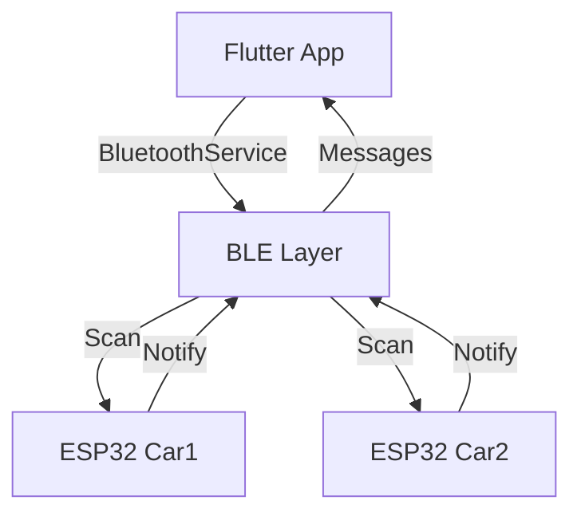
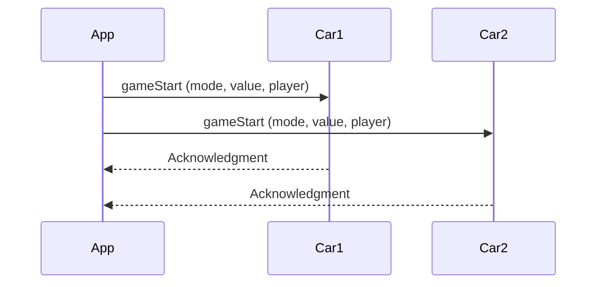
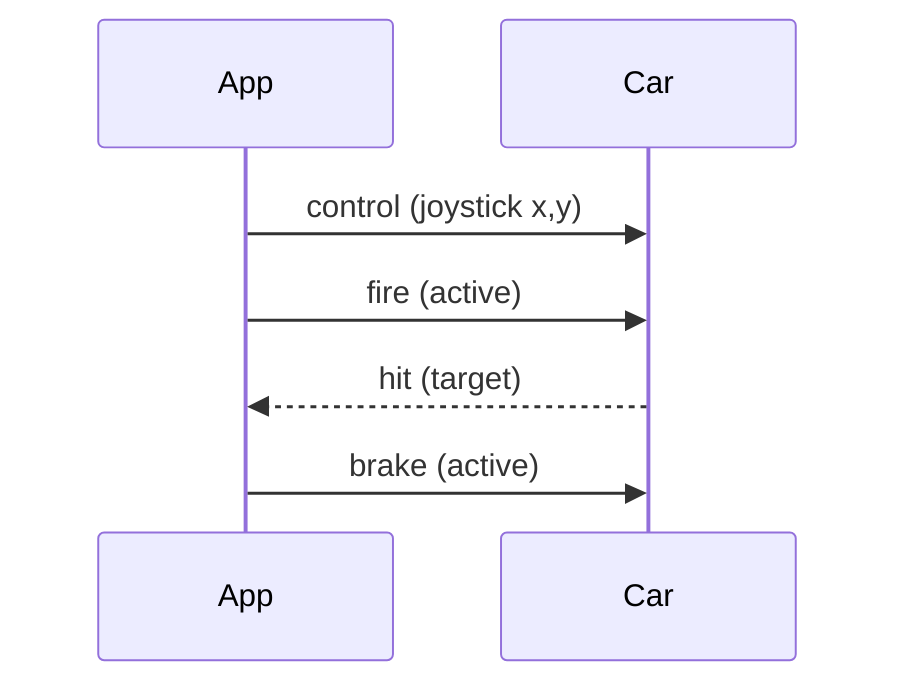

# Bluetooth Low Energy (BLE) Documentation

## Overview
This document explains the BLE implementation in the Laser Car Battle game, covering both the Flutter app and Arduino ESP32 sides.

## Architecture


## Core Components

### 1. BluetoothService
- Handles BLE operations
- Manages device discovery
- Handles message communication
- UUID Configuration:
  ```dart
  SERVICE_UUID = "4fafc201-1fb5-459e-8fcc-c5c9c331914b"
  CHARACTERISTIC_UUID = "beb5483e-36e1-4688-b7f5-ea07361b26a8"
  ```

### 2. Car Identification
- Cars are identified by name prefixes:
  ```dart
  CAR1_PREFIX = "Car1"
  CAR2_PREFIX = "Car2"
  ```
- RSSI (signal strength) helps determine proximity

### 3. Message Communication
- Uses BLE characteristics for data transfer
- Supports notification-based updates
- UTF-8 encoded string messages

## ESP32 Setup

### Car 1 Configuration
```cpp
#define DEVICE_NAME "Car1"
```

### Car 2 Configuration
```cpp
#define DEVICE_NAME "Car2"
```

### BLE Service Structure
1. **Service (UUID: 4fafc201-1fb5-459e-8fcc-c5c9c331914b)**
   - Main communication channel
   - Contains characteristic for data transfer

2. **Characteristic (UUID: beb5483e-36e1-4688-b7f5-ea07361b26a8)**
   - Properties:
     - Read: Get current state
     - Write: Send commands
     - Notify: Receive updates

## Communication Flow

### Device Discovery
1. App starts scanning
2. ESP32s advertise with names
3. App filters for "Car1" and "Car2"
4. Creates BluetoothDevice objects

### Connection Process
1. App connects to device
2. Sets up message handling
3. Subscribes to notifications
4. Starts receiving data

### Message Format
```json
{
  "cmd": "command_type",
  "data": "payload"
}
```

## Implementation Details

### Flutter Side

#### BluetoothService
```dart
class BluetoothService {
  // Core functionality
  - Device scanning
  - Connection management
  - Message handling
  - Resource cleanup
}
```

#### BluetoothDevice Model
```dart
class BluetoothDevice {
  String id
  String name
  int rssi
  CarType carType
  bool isConnected
}
```

### ESP32 Side

#### Basic Structure
```cpp
void setup() {
  1. Initialize BLE
  2. Create Service
  3. Create Characteristic
  4. Start Advertising
}

void loop() {
  1. Check Connection
  2. Handle Commands
  3. Send Updates
}
```

## Error Handling

### Common Issues
1. Connection Failures
   - Retry mechanism
   - User feedback
   
2. Message Errors
   - Data validation
   - Error reporting

3. Device Discovery
   - Timeout handling
   - RSSI filtering

## Best Practices

1. **Resource Management**
   - Always dispose of subscriptions
   - Clean up connections
   - Handle state changes

2. **Battery Optimization**
   - Limited scan duration
   - Efficient message size
   - Connection parameter optimization

3. **User Experience**
   - Clear connection status
   - Error feedback
   - Signal strength indication

## Testing

### Manual Testing Steps
1. Device Discovery
   ```
   - Start app
   - Verify both cars appear
   - Check signal strength
   ```

2. Connection
   ```
   - Connect to each car
   - Verify connection status
   - Check message flow
   ```

3. Communication
   ```
   - Send commands
   - Receive updates
   - Verify data integrity
   ```

## TODO
- [ ] Add reconnection logic
- [ ] Implement message queuing
- [ ] Add connection quality monitoring
- [ ] Implement secure communication
- [ ] Add power management optimizations
- [ ] Create diagnostic logging system

## References
- [Flutter Reactive BLE Documentation](https://pub.dev/packages/flutter_reactive_ble)
- [ESP32 BLE Documentation](https://docs.espressif.com/projects/esp-idf/en/latest/esp32/api-reference/bluetooth/index.html)
- [BLE Specification](https://www.bluetooth.com/specifications/specs/)

## Game Commands Protocol

### Overview
The GameCommands system handles all game-specific communications between the Flutter app and ESP32 cars using standardized message formats.

### Command Types

#### 1. Control Commands
```json
{
  "cmd": "control",
  "x": -1.0 to 1.0,    // Joystick X position
  "y": -1.0 to 1.0     // Joystick Y position
}
```

#### 2. Fire Command
```json
{
  "cmd": "fire",
  "active": true/false  // Fire button state
}
```

#### 3. Brake Command
```json
{
  "cmd": "brake",
  "active": true/false  // Brake button state
}
```

#### 4. Game Start Command
```json
{
  "cmd": "gameStart",
  "mode": "Time|Points",
  "value": number,      // Minutes or target points
  "player": "string"    // Player name
}
```

#### 5. Game End Command
```json
{
  "cmd": "gameEnd"
}
```

#### 6. Hit Detection (Car to App)
```json
{
  "cmd": "hit",
  "target": "Car1|Car2",
  "timestamp": number
}
```

### Implementation Details

#### GameCommands Class Structure
```dart
class GameCommands {
  // Constants
  static const String CMD_CONTROL = "control";
  static const String CMD_FIRE = "fire";
  static const String CMD_BRAKE = "brake";
  static const String CMD_GAME_START = "gameStart";
  static const String CMD_GAME_END = "gameEnd";
  static const String CMD_HIT = "hit";

  // Core Methods
  - sendJoystickControl(deviceId, x, y)
  - sendFire(deviceId, isPressed)
  - sendBrake(deviceId, isPressed)
  - sendGameStart(deviceId, gameMode, value, playerName)
  - sendGameEnd(deviceId)
  - handleIncomingMessages(onHit)
}
```

### Message Flow Examples

#### Starting a Game


#### Gameplay Control


### ESP32 Command Handling

#### Arduino Implementation
```cpp
void handleCommand(String jsonCommand) {
  DynamicJsonDocument doc(200);
  deserializeJson(doc, jsonCommand);

  String cmd = doc["cmd"];
  if (cmd == "control") {
    float x = doc["x"];
    float y = doc["y"];
    handleMovement(x, y);
  } 
  else if (cmd == "fire") {
    bool active = doc["active"];
    handleFire(active);
  }
  // ...other commands
}
```

### Error Handling

#### Common Command Issues
1. Invalid Command Format
   - JSON parsing validation
   - Command type verification
   - Parameter range checking

2. Timing Issues
   - Command queuing
   - Rate limiting
   - State validation

3. Connection Loss
   - Command buffering
   - State recovery
   - Reconnection handling

### Testing Commands

#### Command Testing Checklist
- [ ] Verify all command formats
- [ ] Test parameter ranges
- [ ] Check error handling
- [ ] Validate state changes
- [ ] Test rapid commands
- [ ] Verify command timing
- [ ] Check command queueing

## Project Structure

### Directory Tree

```
lib/
├── main.dart                # Application entry point
├── routes.dart              # App navigation routes configuration
├── assets/                  # Static resources
│   ├── images/              # Image assets
│   └── theme/               # Theming
│       ├── colors/
│       │   └── color.dart   # Color constants definition
│       ├── fonts/
│       │   └── custom_fonts.dart # Font configurations
│       └── custom_theme.dart     # Theme data configuration
├── config/
│   └── env_config.dart      # Environment configuration (API keys, endpoints)
├── forms/
│   └── login_form.dart      # User login form component
├── models/                  # Data models
│   ├── bluetooth_device.dart # Bluetooth device representation
│   ├── car_type.dart        # Car types enumeration
│   ├── game_settings.dart   # Game configuration model
│   ├── leaderboard_entry.dart # Leaderboard data model
│   └── player.dart          # Player information model
├── providers/
│   └── providers.dart       # Provider configuration for dependency injection
├── services/                # Business logic services
│   ├── bluetooth_service.dart # BLE communication service
│   └── game_commands.dart   # Game command protocol implementation
├── utils/                   # Utility functions
│   ├── constants.dart       # App-wide constants
│   └── helpers.dart         # Helper functions for common tasks
├── viewmodels/              # View state management
│   ├── bluetooth_viewmodel.dart    # Bluetooth state management
│   ├── car_controller_viewmodel.dart # Car controls logic
│   ├── game_viewmodel.dart         # Game state management
│   ├── leaderboard_viewmodel.dart  # Leaderboard data handling
│   └── player_viewmodel.dart       # Player state management
├── views/                   # UI screens
│   ├── bluetooth_page.dart        # Device connection screen
│   ├── controller_page.dart       # Car remote control screen
│   ├── game_mode_page.dart        # Game mode selection screen
│   ├── game_over_page.dart        # End of game results screen
│   ├── landing_page.dart          # App entry screen
│   ├── leaderboard_page.dart      # High scores screen
│   └── login_page.dart            # Player login screen
└── widgets/                 # Reusable UI components
    ├── buttons/
    │   ├── action_button.dart     # Primary action button
    │   ├── brake_button.dart      # Car brake control button
    │   ├── fire_button.dart       # Laser firing button
    │   ├── main_button.dart       # Standard button component
    │   └── settings_dropdown.dart # Settings menu component
    ├── custom/
    │   ├── custom_app_bar.dart    # Customized app bar
    │   └── custom_joystick.dart   # Car movement joystick control
    ├── debug_overlay.dart         # Debug information display
    ├── insights.dart              # Game metrics widget
    ├── leaderboard_filter_panel.dart # Leaderboard filtering UI
    ├── project_title.dart         # App title component
    ├── score_board.dart           # In-game score display
    └── status_card.dart           # Status indicator component
```

### Key Components

#### Core Files
- **main.dart**: Bootstrap the application, set up providers, initialize services
- **routes.dart**: Define navigation paths between different screens

#### Model Layer
Models represent the data structures used in the application:
- **bluetooth_device.dart**: Represents a connected BLE device with properties like name, ID, and connection status
- **car_type.dart**: Enum defining the two car types (car1, car2)
- **game_settings.dart**: Stores game configuration like mode and target values
- **leaderboard_entry.dart**: Data structure for storing game results and player statistics

#### Service Layer
Services handle business logic and external interactions:
- **bluetooth_service.dart**: Manages BLE operations including scanning, connecting and data transfer
- **game_commands.dart**: Implements the command protocol for game actions

#### ViewModel Layer
ViewModels manage state and business logic for UI:
- **bluetooth_viewmodel.dart**: Manages BLE device scanning and connection state
- **car_controller_viewmodel.dart**: Handles car control inputs and feedback
- **game_viewmodel.dart**: Manages game flow, scoring, and timer logic
- **leaderboard_viewmodel.dart**: Handles leaderboard data operations and filtering

#### View Layer
Screens and UI components:
- **bluetooth_page.dart**: Screen for scanning and connecting to cars
- **controller_page.dart**: Main game screen with car controls
- **game_mode_page.dart**: Screen for selecting game mode and parameters
- **game_over_page.dart**: Results screen shown after game completion

#### Widget Components
Reusable UI elements:
- **buttons/**: Various button implementations for game controls
- **custom/**: Specialized UI components like joystick
- **score_board.dart**: Real-time game score display
- **debug_overlay.dart**: Development tool for displaying control state

#### Utilities
Helper functions and constants:
- **constants.dart**: App-wide size definitions and static values
- **helpers.dart**: Utility functions for date formatting and other common tasks

## User Interface Components

### Control Elements

#### Joystick Controller
- Custom implementation using flutter_joystick
- Configurable sensitivity and dead zones
- Reports X/Y coordinates (-1.0 to 1.0)
- Haptic feedback on movement
```dart
class CustomJoystick {
  double sensitivityFactor = 0.7
  bool enableHaptics = true
  void Function(double x, double y) onMove
}
```

#### Brake Button
- Supports left and right configurations
- Haptic feedback on press
- Visual feedback with animation
- Asset-based appearance switching
```dart
class BrakeButton {
  bool isRightBrake    // Determines button appearance
  double width/height  // Customizable dimensions
  VoidCallback onPressed/onReleased
}
```

#### Fire Button
- Circular design with pulsing animation
- Haptic feedback on activation
- Support for rapid-fire and hold modes
```dart
class FireButton {
  double size         // Button diameter
  Duration pulseDuration
  VoidCallback onPressed
}
```

### Game Interface Elements

#### Score Board
- Real-time score display
- Support for multiple game modes
- Animated score changes
- Time remaining indicator
```dart
class ScoreBoard {
  int player1Score
  int player2Score
  Duration timeRemaining
  GameMode currentMode
}
```

#### Insights Widget
- Real-time performance metrics
- Connection quality indicator
- Battery status for both cars
- Hit accuracy statistics
```dart
class Insights {
  double connectionQuality
  int batteryLevel
  double hitAccuracy
  int totalShots
}
```

#### Debug Overlay
- Development and testing tool
- Shows control inputs
- Displays BLE connection details
- Performance metrics
```dart
class DebugOverlay {
  bool visible
  Map<String, dynamic> metrics
  List<String> bleMessages
}
```

### ViewModels

#### CarControllerViewModel
Manages car control state and actions:
```dart
class CarControllerViewModel {
  // State
  bool isBraking
  bool isFiring
  Vector2D joystickPosition
  
  // Methods
  void updateJoystickPosition(double x, double y)
  void setBrakeState(bool active)
  void fire()
  void stop()
}
```

#### GameViewModel
Handles game logic and scoring:
```dart
class GameViewModel {
  // Game State
  GameMode mode
  int timeRemaining
  Map<String, int> scores
  bool isGameActive
  
  // Methods
  void startGame()
  void stopGame()
  void updateScore(String player, int points)
  void handleHit(String target)
}
```

### Configuration

#### Environment Variables
Required environment variables in `.env`:
```plaintext
SUPABASE_URL=your_supabase_url
SUPABASE_ANON_KEY=your_anon_key
BLE_SERVICE_UUID=your_service_uuid
BLE_CHARACTERISTIC_UUID=your_characteristic_uuid
```

#### Constants
Game-wide constants in `constants.dart`:
```dart
class AppSizes {
  static const double paddingSmall = 8.0
  static const double paddingMedium = 16.0
  static const double paddingLarge = 24.0
  static const double iconSize = 32.0
}

class GameConfig {
  static const int defaultGameDuration = 180  // seconds
  static const int maxScore = 10
  static const double hitPoints = 1.0
}
```

### Asset Organization

#### Image Assets
Required game images in `lib/assets/images/`:
```
brake.png          - Left brake button image
right-brake.png    - Right brake button image
fire-button.png    - Fire button background
joystick-base.png  - Joystick background
joystick-thumb.png - Joystick control knob
```

### Error States

#### Connection Errors
Handled error scenarios:
- BLE device not found
- Connection timeout
- Signal loss
- Permission denied

#### Game State Errors
Handled game state issues:
- Desynchronized scores
- Invalid game mode
- Timer irregularities
- Command validation failures

## Package Dependencies

The application uses several key Flutter packages to provide core functionality:

### BLE Communication
- **flutter_reactive_ble (v5.4.0)**: Core BLE functionality
  - Provides reactive streams for BLE operations
  - Handles device discovery and connections
  - Supports background operation modes
  - Cross-platform compatibility (iOS and Android)

### Backend Integration
- **supabase_flutter (v2.8.4)**: Backend-as-a-service
  - Authentication handling
  - Realtime database updates
  - Leaderboard storage and synchronization
  - User profile management

### UI Components
- **flutter_joystick (v0.0.4)**: Core control input
  - Customizable joystick interface
  - Direction detection with configurable sensitivity
  - Base appearance customization
  
- **dropdown_button2 (v2.3.9)**: Enhanced dropdown functionality
  - Used for game settings and mode selection
  - Customizable appearance and position
  - Supports complex nested menus

### Device Features
- **vibration (v3.1.3)**: Haptic feedback system
  - Pattern-based vibration sequences
  - Intensity modulation (when supported)
  - Cross-device compatibility handling

- **permission_handler (v11.4.0)**: Runtime permissions
  - BLE permission management
  - Location permission handling (required for BLE)
  - Permission state monitoring

### Data Management
- **shared_preferences (v2.5.2)**: Local storage
  - Game settings persistence
  - User preferences storage
  - Cache for frequently accessed data
  - Offline mode support

## Settings Component

## Offline Support

The application implements robust offline capabilities to ensure playability without an internet connection.

### Offline Mode Features
- Local game history storage
- Deferred synchronization when back online
- Local leaderboard with pending upload status
- Cached game settings


## Performance Optimization


### Resource Management

Key optimization strategies:
- Selective BLE scanning to reduce battery consumption
- Message throttling to prevent command flooding
- Asset preloading for smooth UI transitions
- Background process limitation during active gameplay

## Future Enhancements

### Upcoming Features

#### Multiplayer Expansion
- Server-based game coordination
- Multi-car battles (3+ cars)
- Team-based gameplay modes
- Spectator mode for tournaments

#### Enhanced Hardware Integration
- Support for custom controller hardware
- Additional sensors (gyroscope, accelerometer)
- LED feedback system for cars
- Camera integration for AR overlays

#### AI Components
- Computer-controlled opponents
- Adaptive difficulty based on player skill
- Path optimization and strategy suggestions
- Replay analysis and improvement suggestions

## UI Components Documentation

### Status Card

The StatusCard widget provides a visual indicator of connection or processing status with configurable text and state.

#### Features
- Dynamic state visualization (connected/processing)
- Custom messaging
- Consistent styling with app theme
- Shadow effects for depth

#### Implementation
```dart
class StatusCard extends StatelessWidget {
  // Core properties
  final bool checkStatus;    // Connected (true) or processing (false)
  final String statusText;   // Display message

  // Visual properties
  - Background with custom color and borderRadius
  - Drop shadow effect
  - Fixed height with full width
  - Conditional rendering based on connection state
  - Circular progress indicator for processing state
```

#### Usage Examples
```dart
// Connected state example
StatusCard(
  checkStatus: true,
  statusText: "Bluetooth Connected",
)

// Processing state example
StatusCard(
  checkStatus: false,
  statusText: "Connecting to Device...",
)
```

### Score Board

The ScoreBoard widget displays the game's current score, player names, and timer in a visually appealing format.

#### Features
- Live score tracking
- Player name display
- Dynamic timer with color changes
- Responsive layout
- Visual highlighting for winning player

#### Implementation
```dart
class ScoreBoard extends StatelessWidget {
  // Components:
  - Player 1 name section (left)
  - Middle section containing scores and timer
  - Player 2 name section (right)
  
  // Features:
  - Consumer pattern for real-time updates
  - Visual separation between score and timer
  - Consistent styling with game theme
  - Border decorations for visual appeal
```

#### Score Display Format
```
┌───────────────┬─────────────────┬───────────────┐
│               │                 │               │
│  Player 1     │     3 - 2       │  Player 2     │
│               │                 │               │
│               │     02:45       │               │
│               │                 │               │
└───────────────┴─────────────────┴───────────────┘
```

### Project Title Widget

The TitleText widget renders the game's title with advanced styling effects.

#### Features
- Custom font rendering
- Stroke effects for text
- Shadow effects for depth
- Layered text rendering technique

#### Implementation
```dart
class TitleText extends StatelessWidget {
  // Rendering approach:
  - Stacked text layers using Stack widget
  - Outer layer with stroke styling
  - Inner layer with fill styling
  - Multiple shadow effects for depth
```

## Game Modes

### Points Mode

In Points mode, players compete to be the first to reach a target number of points.

#### Characteristics
- Unlimited time
- Win by reaching target points (configurable: 1-15 points)
- Tracking of elapsed time
- Real-time score updates

#### Implementation Details
```dart
// Game initialization
void setGameSettings(String mode, int value) {
  if (mode == 'Points') {
    _targetPoints = value;  // Target points to win
    // Reset scores and start timers
  }
}

// Win condition check
void _checkWinCondition() {
  if (_gameMode == 'Points' && _targetPoints != null) {
    if (_player1Points >= _targetPoints!) {
      _winner = _player1Name;
      _endGame();
    } else if (_player2Points >= _targetPoints!) {
      _winner = _player2Name;
      _endGame();
    }
  }
}
```

### Time Mode

In Time mode, players compete to have the highest score when the time expires.

#### Characteristics
- Fixed duration (configurable: 1-15 minutes)
- Win by having highest score when timer ends
- Visual and haptic warnings for final countdown
- Support for tie results

#### Implementation Details
```dart
// Game initialization
void setGameSettings(String mode, int value) {
  if (mode == 'Time') {
    _gameValue = value;  // Minutes for game duration
    // Reset scores and start timers
  }
}

// Timer management
void startGame() {
  // Initialize timer that ticks every second
  _timer = Timer.periodic(const Duration(seconds: 1), (timer) {
    if (_gameMode == 'Time') {
      _timeInSeconds++;
      int remainingTime = (_gameValue! * 60) - _timeInSeconds;
      
      // Final countdown behaviors
      if (remainingTime <= 30) _startFlashing();
      if (remainingTime <= 10) _startVibrating();
      
      // End game when time expires
      if (remainingTime <= 0) {
        _determineWinnerForTimeMode();
        _endGame();
      }
    }
  });
}
```

## Player Management

### Player ViewModel

The PlayerViewModel manages player-specific data and operations.

#### Features
- Player name management
- Integration with game state
- Support for multiple players

#### Implementation
```dart
class PlayerViewModel extends ChangeNotifier {
  // Core properties
  final GameViewModel gameViewModel;
  final int playerNumber;  // 1 or 2
  String _playerName = '';

  // Methods
  - Get/set player name
  - Sync with main game state
  - Notify listeners of changes
```

#### State Synchronization
```dart
void setPlayerName(String name) {
  _playerName = name;
  
  // Sync with game state
  if (playerNumber == 1) {
    gameViewModel.player1Name = name;
  } else {
    gameViewModel.player2Name = name;
  }
  
  // Notify listeners to update UI
  notifyListeners();
}
```

## Visual Styling System

### Theme Architecture

The app implements a structured theming system with multiple layers.

#### Core Components
1. **CustomTheme**: Central theme definition
2. **CustomColors**: Color palette constants
3. **CustomFonts**: Typography system
4. **AppSizes**: Dimension constants

#### Theme Hierarchy
```
CustomTheme
   ├── TextTheme
   │    ├── bodyLarge
   │    ├── bodyMedium
   │    └── labelLarge
   │
   ├── ButtonThemes
   │    ├── elevatedButtonTheme
   │    ├── outlinedButtonTheme
   │    └── floatingActionButtonTheme
   │
   ├── AppBarTheme
   │
   └── InputDecorationTheme
```

#### Color System
```dart
class CustomColors {
  // UI Surface Colors
  static const Color background = Color(0xFF212121);
  static const Color mainButton = Color(0xF0616161);
  static const Color backgroundEffect = Color(0xff4f0000);
  
  // Text Colors
  static const Color textPrimary = Color(0xFFFFFFFF);
  static const Color buttonText = Color(0xFFB0BEC5);
  
  // Accent Colors
  static const Color actionButton = Color(0xFFFF9800);
  static const Color fireButton = Color(0xFFFF5722);
  
  // Utility Colors
  static const Color border = Color(0xFF757575);
  static const Color effectColor = Color.fromARGB(128, 0, 0, 0);
  
  // Control Colors
  static const Color joystickBase = Color(0xFF37474F);
  static const Color joystickKnob = Color(0xFF80CBC4);
}
```

## Button Components

### Main Button

Standardized button component for consistent primary actions.

#### Features
- Consistent styling across the app
- Configurable text and action
- Optional background color override
- Border customization

#### Implementation
```dart
class MainButton extends StatelessWidget {
  final String buttonText;
  final VoidCallback? onPressed;
  final Color? backgroundColor;
  final BorderSide? border;
  
  // Building block used by multiple screens
  // Encapsulates styling and behavior in one component
}
```

### Action Button

Compact button designed for secondary actions.

#### Features
- Smaller footprint than MainButton
- Optimized for space-constrained UI areas
- Consistent styling with main buttons

#### Implementation
```dart
class ActionButton extends StatelessWidget {
  final VoidCallback onPressed;
  final String buttonText;
  
  // Uses system theme for consistent styling
  // Fixed size based on AppSizes constants
}
```

### Fire Button

Specialized button for the core gameplay action of firing lasers.

#### Features
- Large circular touch target
- Visual feedback on press
- Cooldown timer visualization
- Haptic feedback
- Disabled state handling

#### Implementation
```dart
class FireButton extends StatefulWidget {
  final VoidCallback onPressed;
  final double size;
  
  // State management for:
  - Active/disabled states
  - Cooldown countdown
  - Haptic feedback triggering
}
```

#### Cooldown Mechanism
```dart
void _handlePress() async {
  if (_isEnabled) {
    // Trigger haptic feedback
    if (await Vibration.hasVibrator()) {
      Vibration.vibrate(duration: 100, amplitude: 255);
    }
    
    // Execute callback
    widget.onPressed();
    
    // Start cooldown
    _isEnabled = false;
    _countNotifier.value = 3;
    
    // Setup countdown timer
    _timer?.cancel();
    _timer = Timer.periodic(const Duration(seconds: 1), (timer) {
      if (_countNotifier.value > 0) {
        _countNotifier.value--;
      } else {
        _isEnabled = true;
        timer.cancel();
        setState(() {});
      }
    });
    
    setState(() {});
  }
}
```

### Brake Button

Specialized button for the brake control action.

#### Features
- Long-press interaction model
- Visual animation on press
- Haptic feedback
- Support for left/right variations

#### Implementation
```dart
class BrakeButton extends StatefulWidget {
  final VoidCallback onPressed;
  final VoidCallback onReleased;
  final double width;
  final double height;
  final bool isRightBrake;
  
  // State management for:
  - Pressed/released states
  - Animation control
  - Image asset selection based on position
}
```

## Debug Features

### Debug Overlay

Provides real-time information about controller state and game operations.

#### Features
- Real-time joystick position display
- Brake state monitoring
- Shot counter
- Last action tracking
- Semi-transparent overlay design

#### Implementation
```dart
class DebugOverlay extends StatelessWidget {
  final CarControllerViewModel controller;
  
  // Content sections:
  - Title bar with "Debug Info"
  - Joystick X/Y coordinates
  - Brake state (true/false)
  - Shot counter
  - Last action performed
  
  // Visual styling:
  - Semi-transparent background
  - Rounded corners
  - Compact text formatting
}
```

## Leaderboard System

### Filter Panel

The LeaderboardFilterPanel provides sorting and filtering capabilities for the leaderboard.

#### Features
- Sort by recent, highest score, or lowest score
- Filter by game mode
- Reset filters option
- Animated display

#### Implementation
```dart
class LeaderboardFilterPanel extends StatefulWidget {
  final LeaderboardViewModel viewModel;
  final String currentSortOption;
  final String currentGameModeFilter;
  final Function(String) onSortChanged;
  final Function(String) onGameModeChanged;
  final VoidCallback onResetFilters;
}
```

### Entry Card

The LeaderboardEntryCard displays a single game result with detailed information.

#### Features
- Winner/loser display
- Score presentation
- Game mode indicator
- Game value information (points target or time limit)
- Duration information
- Timestamp with date and time

#### Implementation
```dart
class LeaderboardEntryCard extends StatelessWidget {
  // Main sections:
  - Player names and match outcome
  - Score display with game mode
  - Game details (target or duration)
  - Date and time of match
}
```

## Game Insights Widget

The Insights widget displays compact game mode and target information during gameplay.

#### Features
- Compact display for game mode
- Dynamic content based on current mode
- Consistent styling with game UI

#### Implementation
```dart
class Insights extends StatelessWidget {
  // Displays either:
  - Time mode with minutes value (e.g., "Time: 3m")
  - Points mode with target (e.g., "Points: 5p")
  
  // Visual styling:
  - Small container with semi-transparent background
  - Border decoration
  - Centered text
}
```

## Game Settings Management

### Game Mode Selection Page

The GameModePage allows players to configure their game session.

#### Features
- Game mode selection dropdown (Points/Time)
- Dynamic value picker based on selected mode
- Visual styling consistent with app theme
- Clear call-to-action for starting game

#### Implementation Highlights
```dart
class GameModePage extends StatefulWidget {
  // Key components:
  - Dropdown for mode selection
  - Conditional picker based on selected mode:
    * NumberPicker for Points mode (1-15 points)
    * NumberPicker for Time mode (1-15 minutes)
  - ActionButton to start game with selected settings
}
```

## Game Flow Management

### Controller Screen

The RemoteController screen is the main gameplay interface.

#### Features
- Layout management for controls
- Toggle for control positioning (left/right)
- Debug overlay toggle
- Game state management
- Orientation handling

#### Core Layout Structure
```
┌─Settings────────────Scoreboard────────────Insights─┐
│                                                    │
│                                                    │
│                                                    │
│                                                    │
│                                                    │
│                                                    │
├─Brake─Fire──────────────────────────────Joystick───┤
```

#### Layout Toggle
```dart
// Control positioning toggle
void onToggleControls() {
  setState(() {
    _controlsOnLeft = !_controlsOnLeft;
  });
}
```

### Game Over Management

The GameOverPage displays results after a game has concluded.

#### Features
- Final score display
- Winner announcement
- Time elapsed display
- Option to share results
- Navigation back to menu
- Orientation management

#### Implementation Highlights
```dart
class GameOverPage extends StatefulWidget {
  // Content sections:
  - Game result header
  - Winner announcement
  - Final score display
  - Time statistics (elapsed or remaining)
  - Share button for results
  - Return to menu button
  
  // Special features:
  - Screenshot generation for sharing
  - Prevent back navigation
  - Portrait orientation enforcement
}
```

## Utility Functions

### Date and Time Formatting

Helper functions for consistent date and time formatting throughout the app.

#### Available Formatters
```dart
// Basic date formatting (DD/MM/YYYY)
String formatDate(DateTime date);

// Basic time formatting (HH:MM)
String formatTime(DateTime date);

// Duration formatting (Xm Ys)
String formatDuration(int seconds);

// Game info formatting ("Time: X minutes" or "First to Y points")
String formatGameInfo(String gameMode, String gameValue);
```

### App Dimensions

Constants for consistent sizing throughout the application.

#### Size Categories
```dart
class AppSizes {
  // Font sizes
  static const double fontSmall = 12.0;
  static const double fontMedium = 16.0;
  static const double fontLarge = 20.0;
  static const double fontTitle = 70.0;
  static const double appBarTitle = 40.0;
  static const double fontMain = 30.0;

  // Border sizes
  static const double borderSmall = 1.0;
  static const double borderMedium = 2.0;
  static const double borderLarge = 10.0;

  // Padding sizes
  static const double paddingSmall = 8.0;
  static const double paddingMedium = 16.0;
  static const double paddingLarge = 24.0;

  // Button sizes
  static const double buttonHeight = 60.0;
  static const double actionButtonWidth = 60.0;
  static const double actionButtonHeight = 40.0;

  // Joystick sizes
  static const double joystickBaseSize = 200.0;
  static const double joystickKnobSize = 80.0;

  // Icons
  static const double iconSize = 60.0;
}
```

## Application Navigation

### Route System

The application uses a centralized route definition system for navigation.

#### Route Structure
```dart
// Routes defined in routes.dart
Map<String, Widget Function(BuildContext)> get routes => {
  '/':            (context) => const LandingPage(),      // Main entry
  '/login':       (context) => const LoginPage(),        // Player info
  '/connect':     (context) => BluetoothPage(),          // Device connection
  '/gameMode':    (context) => const GameModePage(),     // Game configuration
  '/controller':  (context) => const RemoteController(), // Gameplay
  '/game-over':   (context) => const GameOverPage(),     // Results
  '/leaderboard': (context) => LeaderboardPage(),        // High scores
};
```

#### Navigation Flow
1. Landing Page: Entry point with app branding
2. Login Page: Player name input
3. Connect Page: Bluetooth device connection
4. Game Mode: Configure game settings
5. Controller: Main gameplay screen
6. Game Over: Results and sharing
7. Leaderboard: Historical results

### Settings Dropdown

The SettingsDropdown provides access to in-game configuration options.

#### Features
- Control layout toggle
- Debug overlay toggle
- Game exit functionality
- Clean exit with proper resource cleanup

#### Implementation Highlights
```dart
class SettingsDropdown extends StatelessWidget {
  // Options:
  - Switch Controls: Toggles control layout
  - Toggle Debug: Shows/hides debug overlay
  - Exit Game: Safely exits with cleanup
  
  // Exit handling:
  void _handleExit(BuildContext context) {
    // Stop vibrations
    Vibration.cancel();
    
    // Clean up game state
    gameViewModel.stopGame();
    gameViewModel.clearGameSettings();
    
    // Reset controller state
    carController.setBrakeState(false);
    carController.updateJoystickPosition(0, 0);
    
    // Navigate to landing page
    Navigator.of(context).pushNamedAndRemoveUntil(
      '/',
      (Route<dynamic> route) => false,
    );
  }
}
```

## Bluetooth Service Implementation Details

### Device Type Determination

The BluetoothService identifies connected devices based on name patterns.

#### Car Type Detection
```dart
CarType? getCarType(String deviceName) {
  if (deviceName.startsWith(CAR1_PREFIX)) {
    return CarType.car1;
  } else if (deviceName.startsWith(CAR2_PREFIX)) {
    return CarType.car2;
  }
  return null;
}
```

### Message Handling

The service uses a StreamController to broadcast incoming messages from connected devices.

#### Message Broadcasting
```dart
// Controller for broadcasting messages to multiple listeners
final _messageController = StreamController<String>.broadcast();

// Public stream that widgets can listen to for receiving messages
Stream<String> get messages => _messageController.stream;

// When data is received from BLE:
void _handleIncomingData(List<int> data) {
  final message = utf8.decode(data);
  print('Received from Arduino: $message');
  // Broadcast the message to all listeners
  _messageController.add(message);
}
```

## Performance Optimizations

### Game UI Optimizations

Several techniques are employed to ensure smooth gameplay UI.

#### Joystick Performance
- Value throttling to reduce update frequency
- RepaintBoundary to isolate repainting
- Optimized listener implementation

```dart
@override
Widget build(BuildContext context) {
  return RepaintBoundary(  // Isolates repainting
    child: Joystick(
      // Throttled updates
      period: const Duration(milliseconds: 100),
      listener: (details) {
        final scaledX = (details.x * widget.sensitivityFactor)
            .clamp(-1.0, 1.0);
        final scaledY = (details.y * widget.sensitivityFactor)
            .clamp(-1.0, 1.0);
        
        widget.listener(scaledX, scaledY);
      },
    )
  );
}
```

#### Fire Button Optimization
- Value notifier pattern for efficient updates
- State-based rendering optimization

```dart
// Only rebuild the text part when count changes
ValueListenableBuilder<int>(
  valueListenable: _countNotifier,
  builder: (context, value, child) {
    return Text(
      _isEnabled ? 'FIRE' : '$value',
      style: TextStyle(/* ... */),
    );
  },
)
```

### Bluetooth Communication Optimization

Techniques to optimize BLE communication.

#### Message Throttling
```dart
// Limit joystick updates to 100ms intervals
period: const Duration(milliseconds: 100),

// Scale values to reduce insignificant updates
final scaledX = (details.x * widget.sensitivityFactor).clamp(-1.0, 1.0);
final scaledY = (details.y * widget.sensitivityFactor).clamp(-1.0, 1.0);
```

#### Connection Management
```dart
// Scan timeout to preserve battery
_scanTimer = Timer(const Duration(seconds: 15), stopScan);

// Connection timeout for unresponsive devices
connectionTimeout: const Duration(seconds: 10),
```

## State Management Architecture

### Provider Pattern Implementation

The application uses a structured provider system for state management.

#### Provider Hierarchy
```dart
List<ChangeNotifierProvider> getProviders(GlobalKey<NavigatorState> navigatorKey) {
  // Core dependencies
  final supabaseClient = Supabase.instance.client;
  final bluetoothService = BluetoothService();
  
  return [
    // Network and data services
    ChangeNotifierProvider<BluetoothViewModel>(...),
    ChangeNotifierProvider<LeaderboardViewModel>(...),
    
    // Game state management
    ChangeNotifierProvider<GameViewModel>(...),
    ChangeNotifierProvider<PlayerViewModel>(...),
    
    // Controller state management
    ChangeNotifierProvider<CarControllerViewModel>(
      create: (context) => CarControllerViewModel(
        gameViewModel: Provider.of<GameViewModel>(context, listen: false),
        playerNumber: 1,
      ),
    ),
    // Second controller for player 2
    ChangeNotifierProvider<CarControllerViewModel>(
      create: (context) => CarControllerViewModel(
        gameViewModel: Provider.of<GameViewModel>(context, listen: false),
        playerNumber: 2,
      ),
    ),
  ];
}
```

### View-ViewModel Communication

The implementation follows MVVM pattern with clear separation of concerns.

#### Data Flow Patterns
1. **One-way binding**: ViewModels expose state through getters
2. **Command pattern**: Views call ViewModel methods for actions
3. **Notification pattern**: ViewModels notify views through ChangeNotifier
4. **Consumer pattern**: Views subscribe to relevant state changes

#### Example Pattern
```dart
// In view:
Consumer<GameViewModel>(
  builder: (context, gameViewModel, child) {
    return Text(
      gameViewModel.formattedTime,
      style: TextStyle(
        color: gameViewModel.timerColor,  // Dynamic color based on state
      ),
    );
  },
)

// In ViewModel:
Color get timerColor {
  if (_gameMode == 'Time' && _gameValue != null) {
    int remainingTime = (_gameValue! * 60) - _timeInSeconds;
    if (remainingTime <= 30) {
      return _isFlashing ? Colors.red : Colors.white;
    }
  }
  return Colors.white;
}
```