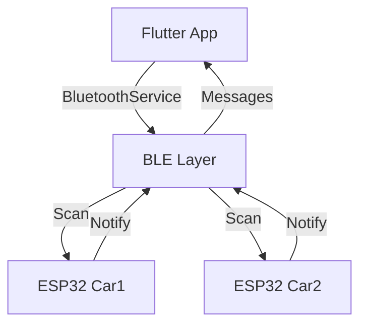
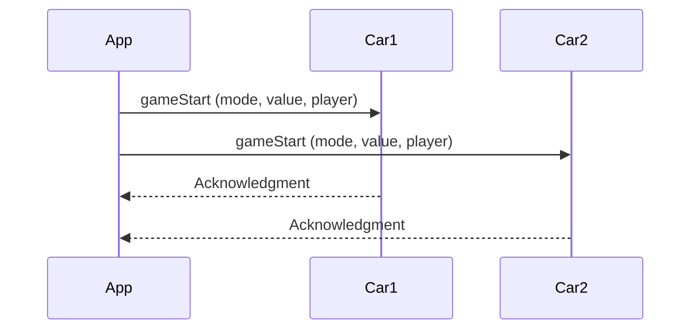
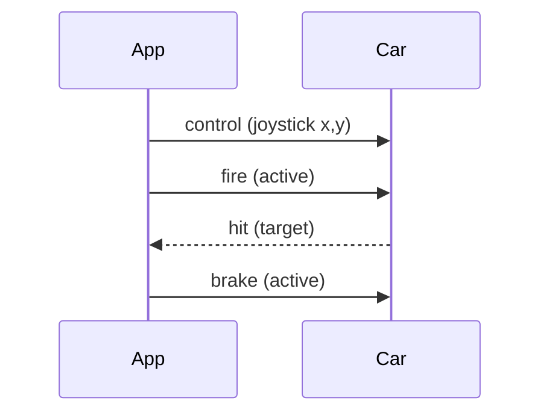

# Bluetooth Low Energy (BLE) Documentation

## Overview
This document explains the BLE implementation in the Laser Car Battle game, covering both the Flutter app and Arduino ESP32 sides.

## Architecture


## Core Components

### 1. BluetoothService
- Handles BLE operations
- Manages device discovery
- Handles message communication
- UUID Configuration:
  ```dart
  SERVICE_UUID = "4fafc201-1fb5-459e-8fcc-c5c9c331914b"
  CHARACTERISTIC_UUID = "beb5483e-36e1-4688-b7f5-ea07361b26a8"
  ```

### 2. Car Identification
- Cars are identified by name prefixes:
  ```dart
  CAR1_PREFIX = "Car1"
  CAR2_PREFIX = "Car2"
  ```
- RSSI (signal strength) helps determine proximity

### 3. Message Communication
- Uses BLE characteristics for data transfer
- Supports notification-based updates
- UTF-8 encoded string messages

## ESP32 Setup

### Car 1 Configuration
```cpp
#define DEVICE_NAME "Car1"
```

### Car 2 Configuration
```cpp
#define DEVICE_NAME "Car2"
```

### BLE Service Structure
1. **Service (UUID: 4fafc201-1fb5-459e-8fcc-c5c9c331914b)**
   - Main communication channel
   - Contains characteristic for data transfer

2. **Characteristic (UUID: beb5483e-36e1-4688-b7f5-ea07361b26a8)**
   - Properties:
     - Read: Get current state
     - Write: Send commands
     - Notify: Receive updates

## Communication Flow

### Device Discovery
1. App starts scanning
2. ESP32s advertise with names
3. App filters for "Car1" and "Car2"
4. Creates BluetoothDevice objects

### Connection Process
1. App connects to device
2. Sets up message handling
3. Subscribes to notifications
4. Starts receiving data

### Message Format
```json
{
  "cmd": "command_type",
  "data": "payload"
}
```

## Implementation Details

### Flutter Side

#### BluetoothService
```dart
class BluetoothService {
  // Core functionality
  - Device scanning
  - Connection management
  - Message handling
  - Resource cleanup
}
```

#### BluetoothDevice Model
```dart
class BluetoothDevice {
  String id
  String name
  int rssi
  CarType carType
  bool isConnected
}
```

### ESP32 Side

#### Basic Structure
```cpp
void setup() {
  1. Initialize BLE
  2. Create Service
  3. Create Characteristic
  4. Start Advertising
}

void loop() {
  1. Check Connection
  2. Handle Commands
  3. Send Updates
}
```

## Error Handling

### Common Issues
1. Connection Failures
   - Retry mechanism
   - User feedback
   
2. Message Errors
   - Data validation
   - Error reporting

3. Device Discovery
   - Timeout handling
   - RSSI filtering

## Best Practices

1. **Resource Management**
   - Always dispose of subscriptions
   - Clean up connections
   - Handle state changes

2. **Battery Optimization**
   - Limited scan duration
   - Efficient message size
   - Connection parameter optimization

3. **User Experience**
   - Clear connection status
   - Error feedback
   - Signal strength indication

## Testing

### Manual Testing Steps
1. Device Discovery
   ```
   - Start app
   - Verify both cars appear
   - Check signal strength
   ```

2. Connection
   ```
   - Connect to each car
   - Verify connection status
   - Check message flow
   ```

3. Communication
   ```
   - Send commands
   - Receive updates
   - Verify data integrity
   ```

## TODO
- [ ] Add reconnection logic
- [ ] Implement message queuing
- [ ] Add connection quality monitoring
- [ ] Implement secure communication
- [ ] Add power management optimizations
- [ ] Create diagnostic logging system

## References
- [Flutter Reactive BLE Documentation](https://pub.dev/packages/flutter_reactive_ble)
- [ESP32 BLE Documentation](https://docs.espressif.com/projects/esp-idf/en/latest/esp32/api-reference/bluetooth/index.html)
- [BLE Specification](https://www.bluetooth.com/specifications/specs/)

## Game Commands Protocol

### Overview
The GameCommands system handles all game-specific communications between the Flutter app and ESP32 cars using standardized message formats.

### Command Types

#### 1. Control Commands
```json
{
  "cmd": "control",
  "x": -1.0 to 1.0,    // Joystick X position
  "y": -1.0 to 1.0     // Joystick Y position
}
```

#### 2. Fire Command
```json
{
  "cmd": "fire",
  "active": true/false  // Fire button state
}
```

#### 3. Brake Command
```json
{
  "cmd": "brake",
  "active": true/false  // Brake button state
}
```

#### 4. Game Start Command
```json
{
  "cmd": "gameStart",
  "mode": "Time|Points",
  "value": number,      // Minutes or target points
  "player": "string"    // Player name
}
```

#### 5. Game End Command
```json
{
  "cmd": "gameEnd"
}
```

#### 6. Hit Detection (Car to App)
```json
{
  "cmd": "hit",
  "target": "Car1|Car2",
  "timestamp": number
}
```

### Implementation Details

#### GameCommands Class Structure
```dart
class GameCommands {
  // Constants
  static const String CMD_CONTROL = "control";
  static const String CMD_FIRE = "fire";
  static const String CMD_BRAKE = "brake";
  static const String CMD_GAME_START = "gameStart";
  static const String CMD_GAME_END = "gameEnd";
  static const String CMD_HIT = "hit";

  // Core Methods
  - sendJoystickControl(deviceId, x, y)
  - sendFire(deviceId, isPressed)
  - sendBrake(deviceId, isPressed)
  - sendGameStart(deviceId, gameMode, value, playerName)
  - sendGameEnd(deviceId)
  - handleIncomingMessages(onHit)
}
```

### Message Flow Examples

#### Starting a Game


#### Gameplay Control


### ESP32 Command Handling

#### Arduino Implementation
```cpp
void handleCommand(String jsonCommand) {
  DynamicJsonDocument doc(200);
  deserializeJson(doc, jsonCommand);

  String cmd = doc["cmd"];
  if (cmd == "control") {
    float x = doc["x"];
    float y = doc["y"];
    handleMovement(x, y);
  } 
  else if (cmd == "fire") {
    bool active = doc["active"];
    handleFire(active);
  }
  // ...other commands
}
```

### Error Handling

#### Common Command Issues
1. Invalid Command Format
   - JSON parsing validation
   - Command type verification
   - Parameter range checking

2. Timing Issues
   - Command queuing
   - Rate limiting
   - State validation

3. Connection Loss
   - Command buffering
   - State recovery
   - Reconnection handling

### Testing Commands

#### Command Testing Checklist
- [ ] Verify all command formats
- [ ] Test parameter ranges
- [ ] Check error handling
- [ ] Validate state changes
- [ ] Test rapid commands
- [ ] Verify command timing
- [ ] Check command queueing
````

This document will be updated as the implementation progresses.